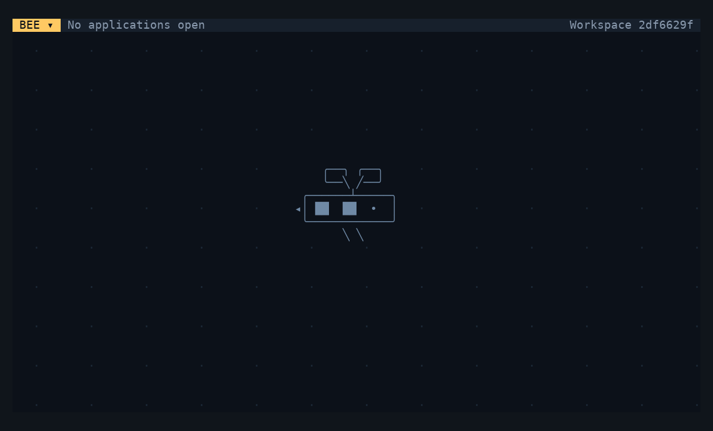

<p align="center">
  
</p>

<p align="center"><strong>A persistent terminal workspace for people, agents, and the tools they build together.</strong></p>

<p align="center">
  <a href="docs/README.md">Documentation</a> ·
  <a href="docs/FOUNDATION_STATUS.md">Current status</a> ·
  <a href="CONTRIBUTING.md">Contributing</a> ·
  <a href="LICENSE">MIT license</a> ·
  <a href="https://github.com/wippyai/runtime">Wippy</a>
</p>

Bee is a terminal desktop for coding. It keeps shells, managed coding agents,
standalone applications, approvals, and durable threads in one workspace. The
executable includes the desktop and its default apps, and a fresh local launch
works offline. Hub access is optional for inspecting and installing components.



*A real standalone Bee session: change the theme, run a command, maximize and
reload the presenter, then inspect running processes.*

## Run

From any project directory:

```sh
bee
bee claude
bee codex
bee agy
bee grok
bee muse
```

The named commands open a managed profile fullscreen through the same admission
path as the Agent picker. The harness must be installed and admitted by the host.
Saved profiles select reviewed options, instructions, MCP scope, hooks, placement,
and recovery behavior; see [saved profiles](docs/handoffs/SAVED_AGENT_PROFILES.md).
Managed Docker launch remains unfinished.

Run `bee observe` in another terminal for a read-only view of the retained local
desktop. Typing cannot control its apps. Ctrl+Q or Ctrl+] detaches that display,
and observation refuses when no Bee is running.

```sh
bee desktops
bee attach WORKSPACE DISPLAY
bee observe WORKSPACE DISPLAY
```

These commands address the Bee selected by `--state-dir`. An occupied desktop
refuses another controller; observation remains explicit. Ctrl+Q detaches a
controller while admitted applications keep running.

## What works

| Surface | Current behavior |
|---|---|
| **Desktop** | Independent client layouts, retained app execution, controller/observer attachment, F12 presenter replacement, themes, resize, mouse and keyboard input |
| **Terminal** | Native interactive programs with the OS user's authority |
| **Agents** | Claude, Codex, Agy, Grok and Muse profiles with scoped MCP, driver hooks, durable threads and qualified recovery |
| **Governed apps** | Agent authoring in durable overlays, immutable freeze, review, approval, destination apply, compatible replacement and restart restoration |
| **Components** | Read-only Hub inspection for agents; host-authorized local plan/apply, requirements, migrations and durable receipts in Modules |
| **Coordination** | Durable Threads and Timeline, explicit subscriptions, Approvals, Inbox projection and scoped agent-to-agent launch |
| **Operations** | Settings, Process Manager, Modules, Overlays, Approvals, Timeline, Hive Manager, About and the runnable UI Guide |

Press **F1** for Start, **Alt+Tab** to switch apps, **F11** to maximize, and
**Ctrl+Q** to detach. Drag windows by their titles and resize from their corners.
**F12** replaces the presenter while applications keep running. Preferences and
supported application checkpoints survive restart; a dead native terminal does
not become a portable checkpoint.

## Current scope

Bee uses the normal Wippy substrate. An admitted component may define services,
functions, owned databases and migrations, drivers, traits, agents, and an
optional UI. Bee governs the exact definitions, destination permissions and
resources, lifecycle, and receipts; component services own their protocol and
domain state.

Local desktop/client attachment, observation, Hub installation, governed app
overlays, managed agents, and policy-routed Hive operations are implemented.
Public Hive enrollment and discovery, remote workspace composition, destination
Hub transfer/install, and managed headless/Docker launch remain unfinished. The
current Hive Manager shows admitted catalog state; it does not imply general
remote control.

## Install from source

**Alpha.** Native builds target Linux and macOS on amd64 and arm64. There is no
published release download yet. Build from a checkout with Git, Go 1.27.0 and a
C compiler:

```sh
make setup
make standalone
mkdir -p "$HOME/.local/bin"
install -m755 dist/bee "$HOME/.local/bin/bee"
export PATH="$HOME/.local/bin:$PATH"
```

The repositories are private during alpha preparation, so Git credentials need
read access to Bee and Builder. Keep `~/.local/bin` on PATH in your shell
configuration. The build and the tested release installer preserve Bee's
workspace state; see [native distribution](docs/NATIVE_DISTRIBUTION.md) and
[releasing](docs/RELEASING.md).

## Development

Start with the [agent guide](docs/AGENT_GUIDE.md) and
[development conventions](docs/DEVELOPMENT.md). Production loads only `src/`;
tests and the historical POC are not runtime dependencies. Run `make check` for
typed Lua, permissions, persistence, packaging, and real terminal acceptance.

| Code | Purpose |
|---|---|
| [src/core](src/core) | Workspace host, applications, desktop, client and storage |
| [src/ui](src/ui) | Shared appearance and application helpers |
| [src/apps](src/apps) | Bundled standalone application processes |
| [src/hub](src/hub) | Local package planning, apply and receipts |
| [src/governance](src/governance) | Overlay authoring, review, activation and recovery |
| [src/hive](src/hive) | Authenticated cross-node operation contracts |
| [src/threads](src/threads) | Durable records, subscriptions and delivery |
| [tests](tests) | Model, source/pack and native acceptance |

[Application contracts](docs/APPLICATION_CONTRACTS.md) ·
[Package boundaries](docs/PACKAGE_BOUNDARIES.md) ·
[System map](docs/SYSTEM_MAP.md)

## License

Bee-owned code and artwork are [MIT](LICENSE). Wippy retains MPL-2.0;
dependencies retain their own licenses.

[Code of conduct](https://github.com/wippyai/.github/blob/main/.github/CODE_OF_CONDUCT.md) · [Security](SECURITY.md)
